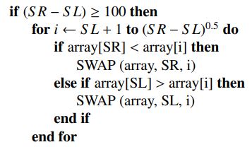

# DAA - Experiment Assignment 1
by Aushaaf Fadhilah Azzah (2106630063)

## Description
This repository contains the implementation, and datasets used on the comparison of Bidirectional Conditional Insertion Sort (BCIS) algorithm vs Counting Sort.

## Additional Info - Flawed(?) Implementation of BCIS Algorithm
Due to the limitations of a three-page paper, I'd like to highlight a crucial observation regarding the running time of the algorithm.

In the examined paper, there appears to be a flawed implementation of the BCIS algorithm. The major issue lies in the pseudocode section presented below:

The BCIS algorithm's time complexity is calculated to be O(n^1.5), primarily due to the section of pseudocode highlighted above. This portion ensures that during each sorting trip, at least sqrt(n) elements are inserted, leading to a running time complexity of O(n^1.5) based on mathematical calculations. However, the flaw in the current pseudocode is that it uses (SR - SL)^0.5 as the upper bound of the loop, which guarantees that only the first sorting trip will insert sqrt(n) elements. To optimize the algorithm and maintain a consistent O(n^1.5) complexity for every sorting step, we should use SL + (SR - SL)^0.5 instead. I don't think it will affect the correctness of the algorithm (cap lmaooo), but it will definitely improve the running time of the algorithm (on average case).
